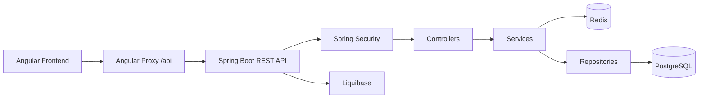

<div align="center">

# Game Store

Full-stack game store application with an Angular storefront and a Spring Boot REST API.


</div>

---

## Snapshot

Game Store is a portfolio-style full-stack project focused on the kind of backend work used in real applications: authentication, authorization, database migrations, caching, DTOs, and user-specific API endpoints.

The frontend is an Angular app for browsing games, creating an account, signing in, viewing account data, and managing a wishlist. The backend is a Spring Boot API backed by PostgreSQL, secured with JWT, and optimized with Redis caching.

## Highlights

| Area | What is included |
| --- | --- |
| Frontend | Angular 21, SCSS, Angular Router, Reactive Forms |
| Backend | Spring Boot 4, Spring Web, Spring Data JPA |
| Security | Spring Security, JWT login, OAuth2 Resource Server, `USER` and `ADMIN` roles |
| Database | PostgreSQL schema managed with Liquibase migrations |
| Caching | Redis caching through Spring Cache |
| Mapping | DTO/entity conversion with MapStruct |
| Dev Data | DataFaker seeding for users, games, and categories |

## Feature Map

| Feature | Status |
| --- | --- |
| Game catalog | Done |
| Product images | Done |
| Categories | Done |
| Account creation | Done |
| Login with JWT | Done |
| Password hashing with BCrypt | Done |
| Angular auth guard | Done |
| Angular JWT interceptor | Done |
| Current-user `/api/me` endpoints | Done |
| Wishlist per logged-in user | Done |
| Role-based authorization | Done |
| Liquibase migrations | Done |
| Redis product/category caching | Done |
| Orders and checkout | Planned |

## Architecture



Protected request flow:

```text
Angular page
  -> route guard checks if a token exists
  -> HTTP interceptor adds Authorization: Bearer <token>
  -> Spring Security validates the JWT
  -> controller receives the request
  -> service reads the logged-in user from the token
  -> repository reads or writes PostgreSQL data
```

## Project Structure

```text
.
|-- frontend/                                  Angular app
|-- src/main/java/com/gamestore/restapis/      Spring Boot backend
|   |-- config/                                Security and cache configuration
|   |-- controllers/                           REST controllers
|   |-- dtos/                                  Request/response DTOs
|   |-- entities/                              JPA entities
|   |-- mappers/                               MapStruct mappers
|   |-- repositories/                          Spring Data repositories
|   `-- services/                              Business logic, JWT, caching
`-- src/main/resources/db/changelog/           Liquibase migrations
```

## Local Setup

Prerequisites:

- Java 25+
- Node.js and npm
- Docker, or local PostgreSQL and Redis installations
- Maven wrapper included as `./mvnw`

Start PostgreSQL:

```bash
docker run --name game-store-postgres \
  -e POSTGRES_PASSWORD=postgres \
  -e POSTGRES_DB=game_store \
  -p 55432:5432 \
  -d postgres:16
```

Start Redis:

```bash
docker run --name game-store-redis \
  -p 6379:6379 \
  -d redis:7-alpine
```

Set a JWT secret:

```bash
export JWT_SECRET="$(openssl rand -base64 64)"
```

Run the backend:

```bash
./mvnw spring-boot:run
```

Run the frontend:

```bash
cd frontend
npm install
npm start
```

Open:

```text
Frontend: http://localhost:4200
Backend:  http://localhost:8080
```

Angular forwards API requests through `frontend/proxy.conf.json`:

```text
/api -> http://localhost:8080
```

## Configuration

Main backend configuration:

```text
src/main/resources/application.yaml
```

Important local settings:

```yaml
spring:
  datasource:
    url: jdbc:postgresql://localhost:55432/game_store
    username: postgres
    password: postgres
  liquibase:
    change-log: classpath:db/changelog/db.changelog-master.yaml
  jpa:
    hibernate:
      ddl-auto: validate
  data:
    redis:
      host: localhost
      port: 6379
  cache:
    type: redis

security:
  jwt:
    secret: ${JWT_SECRET}
```

`JWT_SECRET` must come from the environment or the IDE run configuration. A real JWT secret should never be committed to Git.

## Security

### Register

```text
POST /api/users
  -> UserController
  -> BCryptPasswordEncoder hashes the password
  -> user is saved with role USER
```

### Login

```text
POST /api/auth/login
  -> AuthController
  -> UserRepository.findByEmail()
  -> passwordEncoder.matches()
  -> JwtService.generateToken()
  -> Angular stores the JWT
```

### Authenticated Request

```text
Angular service call
  -> authInterceptor adds Authorization: Bearer <token>
  -> Spring Security validates the JWT
  -> CurrentUserService reads the user id from the JWT subject
  -> controller returns user-specific data
```

### Authorization Rules

| Access | Endpoints |
| --- | --- |
| Public | `POST /api/users`, `POST /api/auth/login` |
| Public | `GET /api/products`, `GET /api/categories` |
| Logged-in user | `/api/me`, `/api/me/wishlist` |
| Admin | product/category mutations, users, profiles, addresses |

Promote a local user to admin:

```sql
UPDATE users
SET role = 'ADMIN'
WHERE email = 'your-email@example.com';
```

Sign in again after changing the role so the new JWT contains the updated role.

## Database Migrations

Liquibase owns the database schema. Hibernate uses `ddl-auto: validate`, so it checks that entities match the schema but does not create or update tables.

Current migrations:

```text
001-create-users.yaml
002-create-categories.yaml
003-create-products.yaml
004-create-addresses.yaml
005-create-profiles.yaml
006-create-wishlist-items.yaml
007-add-user-role.yaml
```

Migration rule:

```text
Do not edit old committed migrations.
Add a new numbered migration for each schema change.
```

Master changelog:

```text
src/main/resources/db/changelog/db.changelog-master.yaml
```

## Redis Caching

Redis is used through Spring Cache.

| Cache | Data |
| --- | --- |
| `products` | product lists, including filtered catalog results |
| `product` | single product by id |
| `categories` | full category list |
| `category` | single category by id |

Cache behavior:

- product reads are cached in `ProductService`
- category reads are cached in `CategoryService`
- creating a product clears product caches
- creating, updating, or deleting a category clears category and product caches

Caching is enabled in:

```text
src/main/java/com/gamestore/restapis/config/CacheConfig.java
```

## API Reference

### Auth

| Method | Endpoint | Access |
| --- | --- | --- |
| `POST` | `/api/auth/login` | Public |

### Users And Account

| Method | Endpoint | Access |
| --- | --- | --- |
| `POST` | `/api/users` | Public |
| `GET` | `/api/me` | User/Admin |
| `PUT` | `/api/me` | User/Admin |
| `DELETE` | `/api/me` | User/Admin |
| `POST` | `/api/me/change-password` | User/Admin |

### Products

| Method | Endpoint | Access |
| --- | --- | --- |
| `GET` | `/api/products` | Public |
| `GET` | `/api/products/{id}` | Public |
| `POST` | `/api/products` | Admin |

### Categories

| Method | Endpoint | Access |
| --- | --- | --- |
| `GET` | `/api/categories` | Public |
| `GET` | `/api/categories/{id}` | Public |
| `POST` | `/api/categories` | Admin |
| `PUT` | `/api/categories/{id}` | Admin |
| `DELETE` | `/api/categories/{id}` | Admin |

### Wishlist

| Method | Endpoint | Access |
| --- | --- | --- |
| `GET` | `/api/me/wishlist` | User/Admin |
| `POST` | `/api/me/wishlist/{productId}` | User/Admin |
| `DELETE` | `/api/me/wishlist/{productId}` | User/Admin |

## Useful Commands

Compile backend:

```bash
./mvnw -q -DskipTests compile
```

Run backend:

```bash
export JWT_SECRET="your-long-random-secret"
./mvnw spring-boot:run
```

Install frontend dependencies:

```bash
cd frontend
npm install
```

Run frontend:

```bash
cd frontend
npm start
```

Build frontend:

```bash
cd frontend
npm run build
```

## Roadmap

Implemented:

- REST API for users, products, categories, profiles, addresses, and wishlist
- JWT login and role-based backend security
- Angular login, route guards, and HTTP interceptor
- Liquibase database migrations
- Redis caching for product and category reads

Planned:

- checkout flow
- real order persistence
- admin dashboard UI
- refresh tokens
- forgot password and email verification
- endpoint tests for security and caching
